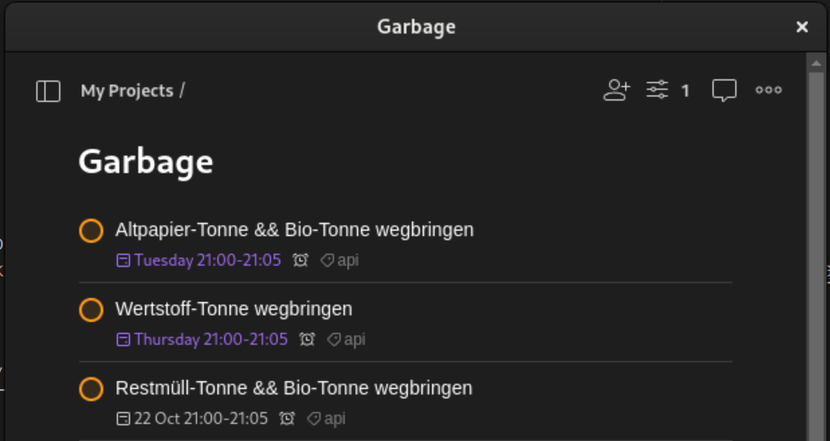

# GarbageCollectionTodoistTasks

> CLI tool that parses a 'Abfallkalender' `.csv` file, and turns the garbage
> collection dates into Todoist tasks

## Setup

    # set `TODOIST_API_KEY` env var or create `.env`

    deno task dev [CSV_FILE_PATH]
    deno task run [CSV_FILE_PATH]

    # example
    deno task dev 2024.CSV

## Development

    deno fmt
    deno lint
    deno check main.ts

### Calendar File

A `.CSV` file is required that only includes events of garbage collection days
such as provided here
[Abfall- und Müllkalender](https://www.raunheim.de/kalender/de/stadtverwaltung/-/2/calendar_show)
or [HERE](https://portal.staedteservice.de/calendar/)

## References

- [Todoist JS SDK](https://developer.todoist.com/rest/v2/?javascript=#overview)
